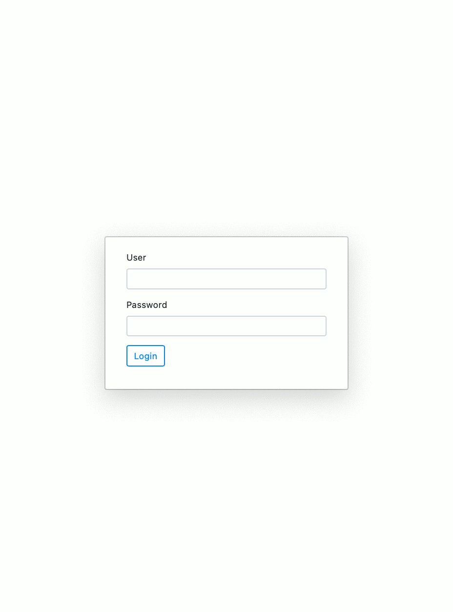
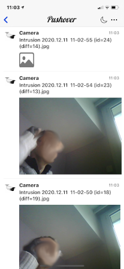
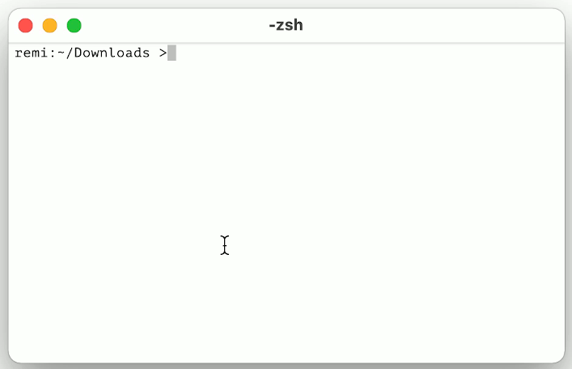

# pycameresp
Motion detection with image notification for ESP32CAM.

All scripts can be used on an ESP32 platform. 
Obviously on platforms other than ESP32CAM does not offer camera and motion detection web pages.
For other python platforms, I have not tried, probably we should remove the links with the esp32 imports, but there are not so many.

Most scripts work on Osx or Linux, I personally use "Visual Studio Code", with python plugins for debugging. 
Of course, in this case the code specific to the camera or to the ESP32 is simulated (see simul directory).

# Features

Below is the list of features supported by the software

- Servers :
	- HTTP web server
	- FTP server
	- Telnet server
	- Login, password can be defined for servers
	- Homekit server

- Clients :
	- NTP synchronization
	- <a href="https://pushover.net">Push over</a> notification with image sent to smartphone

- Web interface
	- Board informations
	- Wifi configuration
	- Access point configuration
	- Server activation
	- User and password initialisation
	- <a href="https://pushover.net">Push over</a> configuration
	- Battery mode configuration

- Tools on the boards :
	- VT100 text editor with python script execution
	- Shell (cd, pwd, cat, mkdir, mv, cp, rm, ls, find, grep, edit, man, ...)
	- Html template engine using <a href="https://jquery.com">jquery</a>, <a href="https://www.w3schools.com/bootstrap4">bootstrap 4</a>

- Micropython firmware patch :
	- Support ADC for GPIO 0,2,4,12,13,14,15,25,26,27
	- Support NVS set, get, erase added
	- Adding reset cause Brownout
	- Embedding all scripts of this software (Faster loading times, reduce RAM footprint)

- Micropython ESP32CAM firmware specifities :
	- Full camera support by micropython
	- Motion detection
	- Web motion configuration
	- Web camera streaming

Ftp, Http, Motion detection works simultaneously, it uses asyncio mechanisms. 
However, during camera streaming, motion detection is suspended to have enough frames per second.

# Screenshots

Web interface



Smartphone motion detection notification (with pushover application)



Shell and text editor executed directly on esp32



You can edit python script, run it directly from the text editor. Connection via telnet or directly with "screen" command on tty.

# Requirements

Micropython on ESP32 does not leave much space in RAM, a SPIRAM is recommended.

Despite everything, the servers, the shell, the text editor can operate on an ESP32 without spiram, 
it is necessary to generate the firmware embedding the python scripts, in this case less memory is consumed.

For motion capture you absolutely need an ESP32CAM.

Homekit cannot work with the camera on ESP32CAM, problem of insufficient memory to store the stack. Homekit seems to work on Esp32 generic.

# Notice for ESP32CAM

Get a firmware already generated or see the section "Micropython firmware" to generates the firmware.

To flash a firmware on the ESP32CAM, see the excellent video :
[ESP32 CAM - 10 Dollar Camera for IoT Projects](https://www.youtube.com/watch?v=visj0KE5VtY)

Once the firmware flashed, the ESP32CAM automatically starts a wifi access point.
You must connect to the SSID **Micropython** access point, the wifi password is **Micropython** .

Once wifi connected, open your web browser on the ip address (http://192.168.3.1).
To use motion detection with image notification, you have to configure :

- (http://192.168.3.1/wifi) Set wifi SSID and password and activate it
- (http://192.168.3.1/accesspoint) Disable the access point for more security
- (http://192.168.3.1/server) Choose available server
- (http://192.168.3.1/changepassword) Enter password and user for more security
- (http://192.168.3.1/pushover) Create push over token and user to receive motion detection image
- (http://192.168.3.1/motion) Activate and configure motion detection
- (http://192.168.3.1/camera) See the camera streaming to adjust its position
- (http://192.168.3.1/battery) Configure the battery mode

To get notifications on your smartphone, you need to install the app [Push over](https://pushover.net), create an account, 
and create an Application/API Token.

Don't forget to activate what you want to work.

**Be careful, the battery mode activations produces deep sleeps, and all the servers are no longer accessible. Only activate it if you know what you are doing.**

# Micropython firmware

The first time I had a lot of trouble rebuilding micropython, I ended up creating scripts to make the job easier.

These scripts work on a linux kubuntu distribution, however they ask when running to install certain tools, so you will have to enter the super user password.

To generate firmware for ESP32CAM, ESP32_SPIRAM, ESP32_GENERIC, you need to run in order.

- **getFirmware.sh** : Get the gits sources, install the necessary tools, position on the right tag
- **patchCFirmware.sh** : Apply the patch on the C micropython and esp32 sources. This fixes some problem, and it adds missing functionality.
- **patchPythonFirmware.sh** : Patch the micropython firmware with python scripts, this makes it possible to embed all the scripts of this project in the firmware, and to accelerate the loading time and reduce memory occupation.
- **buildAllFirmware.sh** : Build the three firmware for the ESP32CAM, ESP32_SPIRAM, ESP32_GENERIC. All firmwares are placed in the firmware directory.
- **buildDoc.sh** : Build the documentation, requires the installation of pdoc3.
- **buildFirmware.sh** : Build one firmware, you must specifie the name (ESP32CAM,GENERIC,GENERIC_SPIRAM)

If you don't want to embed the python scripts in the firmware, just don't run the command patchPythonFirmware.sh.

# Shell

The software embeds a shell directly executable on the board. 

The prompt of shell is : 
```
=>
```
and then you can enter the folling commands :

commands  | help
----------|------
cd        | change directory
pwd       | display the current directory
cat       | show the content of file
mkdir     | create directory
mv        | rename file or directory
rmdir     | remove directory
cp        | copy file or directory with content
df        | display disk free space
rm        | remove file
ls        | list file
date      | display current date
find      | find a file
run       | run python script
edit      | edit python script
exit      | exit of shell
gc        | do a garbage collection
grep      | grep text in files
mount     | mount sd card
umount    | umount sd card
meminfo   | display memory informations about ESP32
flashinfo | display flash informations about ESP32
sysinfo   | display systeme informations
deepsleep | do a deep sleep
reboot    | reboot the board
help      | display the help of all commands
man       | display the help of specific command

To use the shell, you have to stop the servers, for that you just have to log in telnet on it, do a Control-C, and you see :
```
Server stopped
/=>
```

To restart server enter exit command :
```
/=> exit
Server restarted
```

If you done twice Control-C, you get the python prompt, to return to the shell do this :
```
>>> import shell
>>> shell.shell()
```

To edit a script, just enter
```
=> edit myscript.py
```
Press escape to exit from text editor, F5 execute the script currently being edited (execution looks for a main function and executes it).

# Text editor

This editor works directly in the board. The text editor uses VT100 sequence escapes, on your computer, you must have a shell that supports these sequence escapes.
This allows you to make quick and easy changes directly on the board, without having to use synchronization tools. 
This editor allows script execution, and displays errors and execution time.

Editor shortcuts : 
- **Exit**         : Escape
- **Move cursor**  : Arrows, Home, End, PageUp, PageDown, Ctrl-Home, Ctrl-End, Ctrl-Left, Ctrl-Right
- **Selection**    : Shift-Arrows, Shift-Home, Shift-End, Alt-Shift-Arrows, Ctrl-Shift-Left, Ctrl-Shift-Right
- **Clipboard**    : Selection with Ctrl X(Cut), Ctrl-C(Copy), Ctrl-V(Paste)
- **Case change**  : Selection with Ctrl-U(Toggle majuscule, minuscule)
- **Indent**       : Selection with Tab(Indent) or Shift-Tab(Unindent)
- **Comment block**: Selection with Ctrl-Q
- **Save**         : Ctrl-S
- **Find**         : Ctrl-F
- **Replace**      : Ctrl-H
- **Toggle mode**  : Ctrl-T (Insertion/Replacement)
- **Delete line**  : Ctrl-L
- **Goto line**    : Ctrl-G
- **Execute**      : F5

This editor also works on linux and osx, and can also be used autonomously,
you need to add the useful.py script to its side of editor.py. 
All the keyboard shortcuts are at the start of the script editor.py.

**On the boards with low memory, it may work, but on very small files, otherwise it may produce an error due to insufficient memory.**

# Directories

Below are the directory details :
- **patch/c** : patch to be applied to the C sources of the firmware.
- **patch/python** : patch to be applied to embed the python scripts in the firmware.
- **firmware** : contains all the firmware sources when using the getFirmware.sh command. The generated firmwares are stored in this directory.
- **doc** : documentation extracted from python scripts
- **images** : images used into the documentation
- **modules/www** : html page used to create the source file of the html templates.
- **modules/simul** : python scripts to simulate on linux or osx, it allows debugging on vscode.
- **modules/lib/shell** : shell and editor python sources
- **modules/lib/homekit** : homekit python class to interface with homekit firmware
- **modules/lib/htmltemplate** : html templates python sources
- **modules/lib/webpage** : web pages python sources
- **modules/lib/video** : camera python sources
- **modules/lib/motion** : motion detection python sources
- **modules/lib/tools** : tools used for all python sources
- **modules/lib/server** : Ftp, Http, Pushover, Telnet, Ntp synchronization, user and session python sources
- **modules/lib/wifi** : Wifi and accesspoint python sources
- **modules/config** : Configuration saved in this directory

On a standard micropython firmware, copy all the files of the modules directory with its tree structure, 
into the flash memory of the board.

# Library documentation
[See python module documentation](http://htmlpreview.github.com/?https://github.com/remibert/pycameresp/blob/main/doc/lib/index.html)

# Homekit

This part requires the modified python firmware for esp32. See the python examples in directory examples/homekit. 
If after testing, you can no longer see your homekit accessory, then it may be necessary to do a Homekit.eraseAll(), this destroys the current homekit accessory. With great regret, I did not get the camera to work at the same time as the homekit, it seems that there are difficulties to cohabit, due to not enough space of memory, to allocate process.

# Battery mode for ESP32CAM

This operating mode allows you to place an ESP32CAM on battery, and to wake it up with a PIR sensor.
It is important to specify that the waking of the ESP32CAM, and the start of micropython, camera takes a fifteen seconds, it is then possible to miss motion images.

**Be careful, the battery mode activations produces deep sleeps, and all the servers are no longer accessible. Only activate it if you know what you are doing.**

To be able to operate the ESP32CAM on battery, some hardware modifications are required.

## Battery level detection
The **GPIO 12** is used to detect the battery level. The voltage must not be greater than 1.5V otherwise it will no longer boot.

A 100k(on +) connected to 50k (on gnd) resistor between the battery connector, and take the middle of resistor to connect it to the GPIO 12.

You need to calibrate the ADC values to 4.2v (100%) and 3.85v (0%) in web configuration page.

## PIR sensor
PIR detection connected on the **GPIO 13**, I use the SR602. 
With the SR602 you have to extend the detection delay (10s > boot time ESP32CAM) otherwise you lost the state (adding 90k resistor, see specification of SR602).

## Limit the consumption of the ESP32CAM on battery
In deep sleep mode, the AMS1117 regulator consumes 10mA, if you want your batteries not to drain too quickly,
you have to use an external LDO regulator 3.3V (in my case 6206A) and remove AMS1117 of the ESP32CAM (powered by 3.3 v it still consumes 4ma).
Then the consumption is close to 1.7mA with the SR602. 

## Reduce the browout reset
To avoid reset brownout, you must add a 2200uF capacitor on 3.3v.

## Battery
Take 2 or more 18650 battery in parallel to avoid brownouts reset. 


